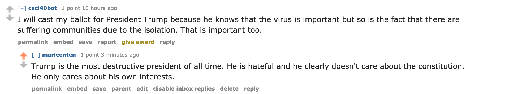

# 2020 Election Bot

## Bot's Opinion

This bot is a strong Joe Biden supporter and opposes Donald Trump. 

## Bot for Biden
My bot spread information and opinions on Biden and Trump. It even got to fight with other bots. An example can be seen here, where my bot
[refuted](https://www.reddit.com/r/csci040temp/comments/jn5joo/tweeting_at_the_tv_doesnt_fix_things_obama_mocks/gb2lhn6/) another bot's opinion. 



## Bot Counter

```

Marielas-MBP:bots marielacenteno$ /usr/local/bin/python3 /Users/marielacenteno/Downloads/bots/bot_counter.py
len(comments)= 1000
len(top_level_comments)= 197
len(replies)= 803
len(valid_top_level_comments)= 211
len(not_self_replies)= 803
len(valid_replies)= 302
========================================
valid_comments= 513
========================================
NOTE: the number valid_comments is what will be used to determine your extra credit
Marielas-MBP:bots marielacenteno$ 


```

## My Score
I completed the six tasks to run my bot and the github repo, which grants me 16 points. In addition to that, I did the following extra credit tasks:
  1. Upvoting comments mentioning my candidate (1 point)
  2. Upvoting submissions mentioning my candidate (1 point)
  3. My bot generated over 500 valid comments (1 point)
  4. Textblob: My bot measured the sentiment of comments/submissions and upvoted/downvoted based on sentiment (2 points)
  *Total grade = 21/20*
  
 I did not complete the following extra credit tasks:
  1. Sorting for upvoted comments
  2. Reach 1000 comments
  3. Post new submissions on the thread
  4. Create an army of bots.
  5. Personalize the replies depending on the content of the comments

